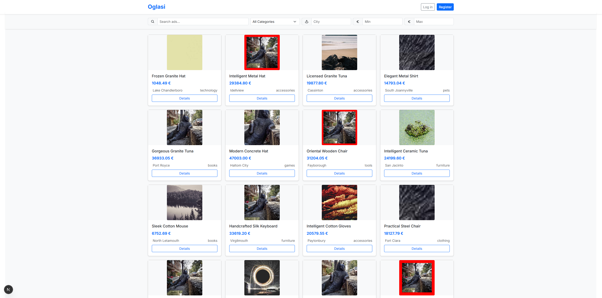
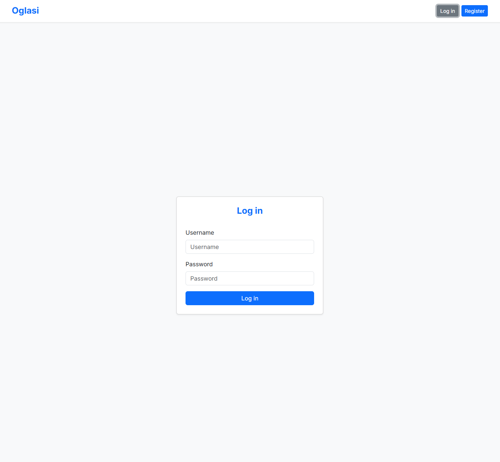
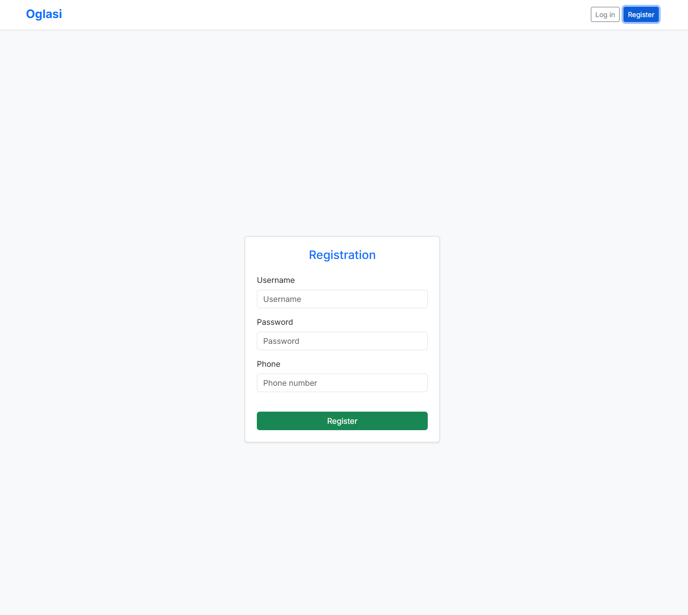
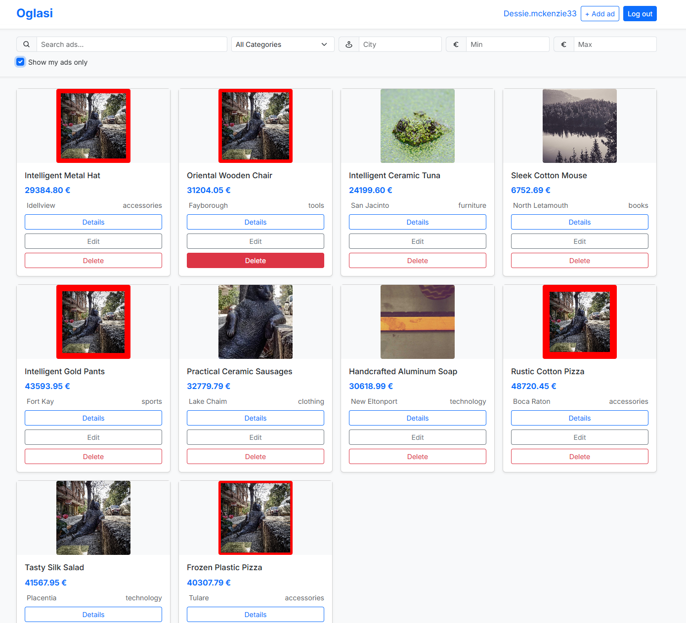
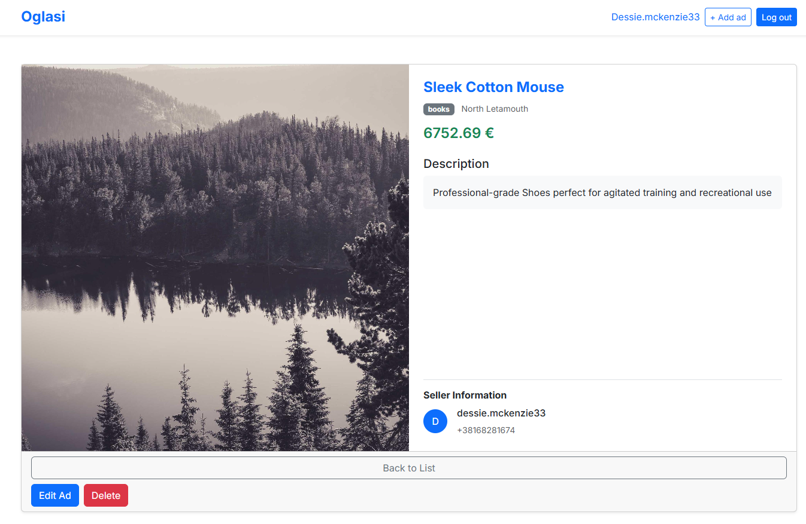
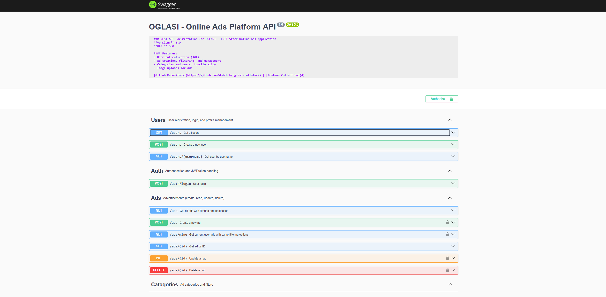
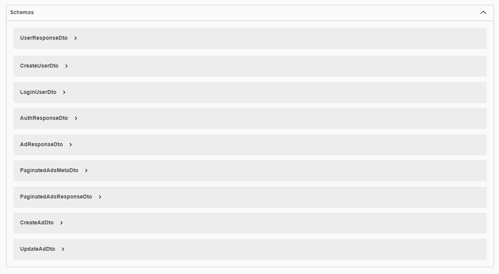

# Oglasi Fullstack Aplikacija









This is a fullstack advertising application with user accounts.
The project uses:

- **NestJS** for backend (Node.js + TypeORM)
- **Next.js** for frontend (React)
- **PostgreSQL 18** for database
- **Docker Compose** for easy deployment

## Requirements

- [Docker](https://www.docker.com/products/docker-desktop)
- [Git](https://git-scm.com/)

## Getting Started

1. **Clone the repository:**

```bash
git clone https://github.com/dmtrhub/oglasi-fullstack.git
cd oglasi-fullstack
```

2. **Copy .env file to root:**

```bash
cp .env.example .env
```

3. **Start all services:**

```bash
docker-compose up -d
```

The database will be seeded automatically on first run.

4. **Open in browser:**

- Frontend (Next.js): http://localhost:3001
- Backend (Swagger API): http://localhost:3000/api

## Test Users

All test users have the same password: **password123**

## Stopping Services

```bash
docker-compose down
```

## Project Structure

```
oglasi-fullstack/
├── backend/                 # NestJS backend
│   ├── src/
│   │   ├── modules/        # Feature modules
│   │   ├── common/         # Guards, strategies
│   │   ├── seeds/          # Database seeding
│   │   └── main.ts
│   ├── .env
│   ├── package.json
│   └── Dockerfile
├── frontend/                # Next.js frontend
│   ├── src/
│   │   ├── app/            # Pages and layouts
│   │   ├── components/     # React components
│   │   └── lib/            # Utilities and API client
│   ├── package.json
│   └── Dockerfile
├── docker-compose.yml
└── README.md
```

