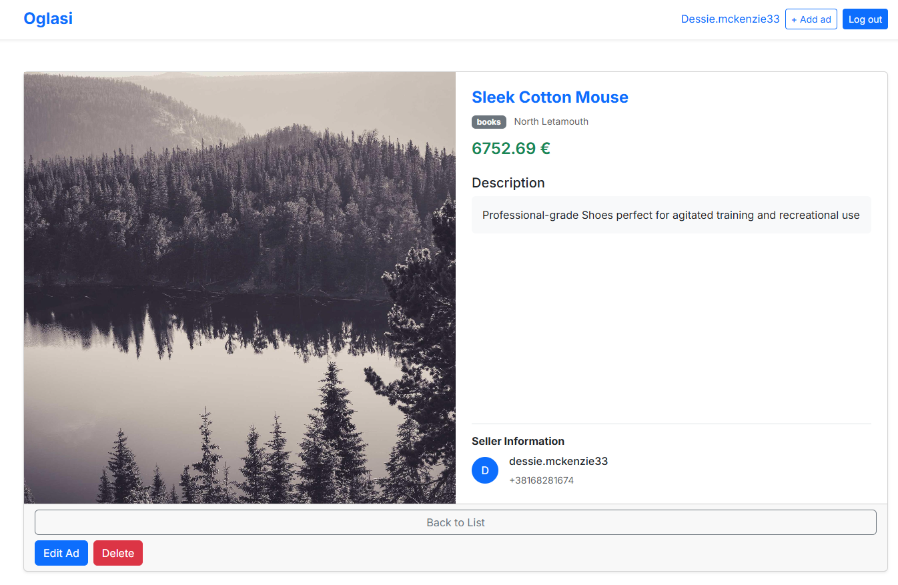

# Oglasi Fullstack Aplikacija





Ovo je fullstack aplikacija za oglašavanje sa korisničkim nalozima. Projekat koristi:

- **NestJS** za backend (Node.js + TypeORM)
- **Next.js** za frontend (React)
- **PostgreSQL 17** za bazu podataka
- **Docker Compose** za jednostavno pokretanje

---

## Potrebni alati

- [Docker](https://www.docker.com/products/docker-desktop)
- [Git](https://git-scm.com/)

---

## Pokretanje projekta

1. **Kloniraj repozitorijum:**

```bash
git clone https://github.com/dmtrhub/oglasi-fullstack.git
cd oglasi-fullstack
```

2. **Kopiraj .env.example u .env:**

```bash
cp backend/.env.example backend/.env
```

3. **Pokreni sve servise:**

```bash
docker-compose up -d
```

4. **Napuni bazu podacima (Seed):** // Svaki put briše stare i dodaje novih 100 oglasa + 10 korisnika

```bash
docker-compose run seed
```

5. **Otvorite u browseru:**

Frontend (Next.js): http://localhost:3001

Backend (Swagger): http://localhost:3000/api  // Kompletna swagger dokumentacija

---

## Prijava korisnika

**Svi test korisnici imaju istu test lozinku: password123**

---

## Zaustavljanje kontejnera

```bash
docker-compose down -d
```

---

## Potpuno brisanje starih podataka (volumes i images)

```bash
docker system prune -a
docker volume rm oglasi-fullstack_postgres_data
```

---

## Struktura projekta

oglasi-fullstack/
│
├── backend/           # NestJS backend
│   ├── src/
│   ├── .env.example
│   └── Dockerfile
│
├── frontend/          # Next.js frontend
│   ├── pages/
│   └── Dockerfile
│
├── docker-compose.yml # Definicija svih servisa
├── README.md          # Ovaj fajl
└── .gitignore

